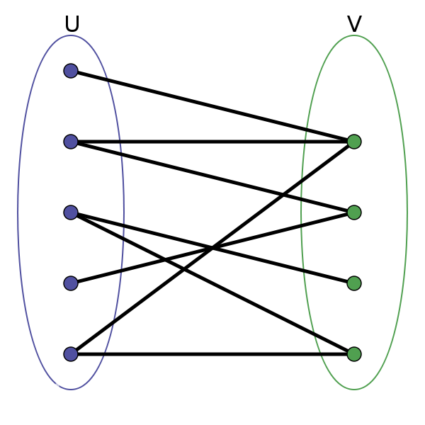
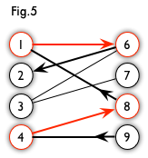
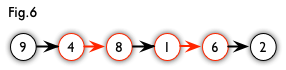
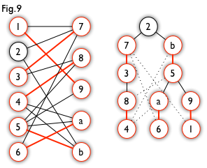

## 匈牙利算法和二分图
首先，匈牙利算法被封装为一个networkX的子函数：
```python
nx.algorithms.matching.max_weight_matching(G, maxcardinality=True)
```
这意味着我们只需要会调用。下面的内容给出算法的原理。

匈牙利算法用于解决**最大权问题**。在开始介绍最大权问题前，我们先简单介绍二分图。

在图论中，“图”由“边”和边的交点即“节点”组成，二叉树就是一个图。而二分图，顾名思义，是指这个图可以分为两半。严格来说，它要求这两半互不相交，且图中每条边连接的两个点都属于不同的区域。如下图就是一个二分图。



### 匹配
匹配就是一种配对，即左边部分的元素与右边部分的元素相配对，且这种配对要求1对1的配对。

满足这种匹配条件的边，称为匹配边。不满足的就是非匹配边。被匹配的点称匹配点。显然，对于一个确定的图，并不一定能保证全图所有点所有边都能被匹配。我们要找匹配率最高的那种情况，即最大匹配。

### 最大权问题
现在我们可以着手最大权问题。

给定一个二分图 $G = (U, V, E)$，其中 $U$ 和 $V$ 是节点集合，$E$ 是边集。每条边 $(u, v) \in E$, 其中 $u \in U$ 和 $v \in V$，连接点u和点v，并且有一个相关的权重 $w(u, v)$。

最大权匹配问题要求找到一个匹配 $M \subseteq E$，使得匹配的权重总和$$∑w(u,v)$$最大。

按照定义，我们要找的那个匹配一定是这个图的子图，即从图中的点和边中选择其中的几条，而不能自己创造边。

为了讲述算法，我们要引入下面的概念：

### 交替路
从一个未匹配点出发，依次经过 非匹配边、匹配边、非匹配边… 形成的路径。注意交替的是边而不是点。如下图，我们创建一个匹配，即1-6、4-8的两个配对组成一个的匹配（红色）。那么下面就是一个交替路。



### 增广路
从一个未匹配点出发，走交替路，若途径另一未匹配点（除起点外），则这条交替路称为增广路。上图也是一个增广路。

而增广路有一个很有用的性质：**路 P 的非匹配总边比匹配边多一条**。

这也意味着，经过取反操作（即把上图红色和黑色互换，黑色视为匹配）可以得到一个更大的匹配（匹配边+1）。故可以通过不停地找增广路来增加匹配中的匹配边和匹配点。

当一个匹配方法不能再被增广，即不能找出一个增广路包含这个匹配，说明这个匹配是最大匹配。这就是匈牙利算法。


至此就是匈牙利算法需要的全部图论知识。

### 匈牙利算法
匈牙利树一般由 DFS （深度优先搜索）构造，其是从一个未匹配点出发，走交替路，直到另一个未匹配点结束（即一个增广路）。


```
开始时，每个节点都未被匹配。

对于图中左侧的每个节点u：
    设置标号lx[u]为节点u所有出边的最大权重。
    设置标号ly[u]为0。

重复以下步骤直到所有节点都被匹配：
    选择一个未匹配的左侧节点u。
    使用广度优先搜索（BFS）从u开始，尝试找到一条增广路径。
    如果找不到增广路径：
        更新lx和ly的值来允许找到新的增广路径。
    如果找到了增广路径：
        更新匹配，将路径上的边加入匹配集合。
    重复这个过程。

完成后，返回所有的匹配。
```

由于不对标算法竞赛，自己写一个匈牙利算法没有任何意义。python庞大的开源社区可以为我们所用，我们只需要导入python的图论库`networkX`，即可调用已被封装为函数的匈牙利算法。

```python
import networkX as nx
# 创建一个无向图
G = nx.Graph()

# 添加边和权重示例
G.add_edge('A', '1', weight=3)
G.add_edge('A', '2', weight=2)
G.add_edge('B', '1', weight=1)
G.add_edge('B', '2', weight=3)
G.add_edge('C', '3', weight=5)

# 使用匈牙利算法寻找最大权匹配
max_match = nx.algorithms.matching.max_weight_matching(G, maxcardinality=True)

print(max_match)
```


严格来说，我们介绍的算法是KM算法，即Kuhn-Munkres算法，也被称为改进的匈牙利算法。

最简单的匈牙利算法的一个显而易见的应用是，对于M个求职者和N个职业，每个求职者有自己的几个心仪的职业，如何一对一地分配职业使得每个人都满意。这里的“心仪”就是一种只有布尔值的权。而KM算法允许更复杂的权值。

而networkx里的`algorithms.matching.max_weight_matching`能很好实现KM算法的功能。
